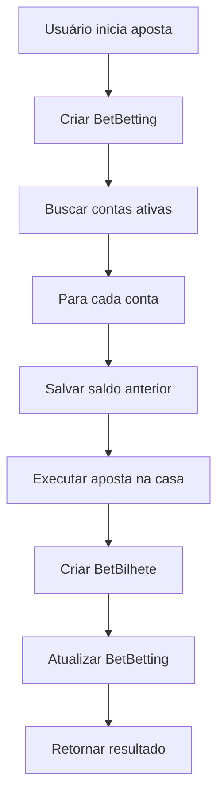

# 🎯 Sistema de Extrato de Apostas - Análise e Proposta

## 📋 Visão Geral do Sistema Atual

### **Arquitetura Existente**
- **Frontend**: Next.js 14+ com App Router
- **Backend**: API Routes do Next.js
- **Database**: MySQL com TypeORM
- **Cache**: Redis para tokens e sessões
- **Plataformas**: Biahosted (Lotogreen, McGames, EstrelaBet, Jogo de Ouro) + FSSB

### **Entidades Atuais**
```typescript
// Contas do AutoBet
Account {
  id: string;
  email: string;
  password: string;
  name?: string;
  isActive: boolean;
  lastLoginAt?: Date;
}

// Contas das Casas de Aposta
BetAccount {
  id: string;
  platform: string;        // 'biahosted', 'fssb'
  site: string;           // 'lotogreen', 'mcgames', etc.
  email: string;
  password: string;
  siteUrl: string;
  balance: number;        // Saldo em centavos
  userId?: string;
  isActive: boolean;
  accountId: string;      // FK para Account
}
```

## 🎯 Objetivo: Sistema de Extrato de Apostas

### **Problema Identificado**
Atualmente o sistema executa apostas automáticas mas **não persiste os resultados** das apostas realizadas. Não há controle de:
- Bilhetes individuais de cada casa de aposta
- Stake total investido por rodada de apostas
- Odd média das apostas
- Saldo anterior vs posterior
- Histórico completo para análise

### **Solução Proposta**
Implementar um sistema completo de **rastreamento e análise de apostas** com duas entidades principais:

## 🗄️ Nova Estrutura do Banco de Dados

### **1. Entidade BetBilhete**
```typescript
@Entity('bet_bilhetes')
export class BetBilhete {
  @PrimaryGeneratedColumn('uuid')
  id!: string;

  @Column({ type: 'varchar', length: 50 })
  platform!: string;        // 'biahosted', 'fssb'

  @Column({ type: 'varchar', length: 100 })
  site!: string;            // 'lotogreen', 'mcgames', etc.

  @Column({ type: 'varchar', length: 36 })
  betAccountId!: string;    // FK para BetAccount

  @Column({ type: 'varchar', length: 36 })
  betBettingId!: string;    // FK para BetBetting

  @Column({ type: 'varchar', length: 100, nullable: true })
  bilheteId?: string;       // ID do bilhete na casa de aposta

  @Column({ type: 'decimal', precision: 10, scale: 2 })
  stake!: number;           // Valor apostado neste bilhete

  @Column({ type: 'decimal', precision: 8, scale: 3 })
  odd!: number;             // Odd específica deste bilhete

  @Column({ type: 'decimal', precision: 10, scale: 2, nullable: true })
  potentialWin?: number;    // Ganho potencial (stake * odd)

  @Column({ type: 'decimal', precision: 10, scale: 2, nullable: true })
  actualWin?: number;       // Ganho real após resultado

  @Column({ type: 'decimal', precision: 10, scale: 2 })
  balanceBefore!: number;   // Saldo antes da aposta

  @Column({ type: 'decimal', precision: 10, scale: 2, nullable: true })
  balanceAfter?: number;    // Saldo após a aposta

  @Column({ 
    type: 'enum', 
    enum: ['pending', 'won', 'lost', 'cancelled', 'refunded'],
    default: 'pending'
  })
  status!: string;

  @Column({ type: 'json', nullable: true })
  betData?: any;           // Dados completos da aposta (seleções, mercados, etc.)

  @Column({ type: 'json', nullable: true })
  resultData?: any;        // Dados do resultado retornado pela casa

  @Column({ type: 'text', nullable: true })
  errorMessage?: string;    // Mensagem de erro se houver

  @CreateDateColumn({ type: 'datetime' })
  createdAt!: Date;

  @UpdateDateColumn({ type: 'datetime' })
  updatedAt!: Date;
}
```

### **2. Entidade BetBetting**
```typescript
@Entity('bet_bettings')
export class BetBetting {
  @PrimaryGeneratedColumn('uuid')
  id!: string;

  @Column({ type: 'varchar', length: 36 })
  accountId!: string;      // FK para Account (usuário do AutoBet)

  @Column({ type: 'varchar', length: 255, nullable: true })
  description?: string;     // Descrição da estratégia/aposta

  @Column({ type: 'decimal', precision: 10, scale: 2 })
  stakeTotal!: number;     // Stake total investido em todas as contas

  @Column({ type: 'decimal', precision: 8, scale: 3 })
  averageOdd!: number;     // Odd média de todos os bilhetes

  @Column({ type: 'int' })
  totalBilhetes!: number;  // Quantidade total de bilhetes criados

  @Column({ type: 'int' })
  successfulBilhetes!: number; // Bilhetes criados com sucesso

  @Column({ type: 'int' })
  failedBilhetes!: number; // Bilhetes que falharam

  @Column({ type: 'decimal', precision: 10, scale: 2, nullable: true })
  totalPotentialWin?: number; // Ganho potencial total

  @Column({ type: 'decimal', precision: 10, scale: 2, nullable: true })
  totalActualWin?: number;   // Ganho real total

  @Column({ type: 'decimal', precision: 10, scale: 2, nullable: true })
  profitLoss?: number;       // Lucro/Prejuízo final

  @Column({ 
    type: 'enum', 
    enum: ['pending', 'completed', 'partial', 'failed'],
    default: 'pending'
  })
  status!: string;

  @Column({ type: 'json', nullable: true })
  betConfig?: any;         // Configuração da aposta (mercados, seleções, etc.)

  @Column({ type: 'json', nullable: true })
  summary?: any;           // Resumo dos resultados por plataforma

  @CreateDateColumn({ type: 'datetime' })
  createdAt!: Date;

  @UpdateDateColumn({ type: 'datetime' })
  updatedAt!: Date;
}
```

## 🔄 Fluxo de Funcionamento

### **1. Execução da Aposta**


### **2. Processo Detalhado**
1. **Início da Aposta**:
   - Criar registro `BetBetting` com dados gerais
   - Calcular stake total (stake × número de contas)

2. **Para cada conta ativa**:
   - Salvar `balanceBefore` no `BetBilhete`
   - Executar aposta na casa de aposta
   - Salvar resposta completa no `betData`
   - Criar registro `BetBilhete` com status `pending`

3. **Após execução**:
   - Atualizar `BetBetting` com estatísticas
   - Calcular `averageOdd` dos bilhetes criados
   - Definir status baseado no sucesso das apostas

4. **Fechamento** (quando resultados chegam):
   - Atualizar status dos `BetBilhete`
   - Calcular ganhos/perdas
   - Atualizar `BetBetting` com resultado final

## 🎨 Interface do Frontend

### **1. Dashboard Principal**
- **Cards de Resumo**:
  - Total apostado hoje/semana/mês
  - Lucro/Prejuízo atual
  - Taxa de sucesso das apostas
  - Número de bilhetes ativos

### **2. Extrato de Apostas**
- **Filtros**:
  - Por período (hoje, semana, mês, customizado)
  - Por conta específica
  - Por plataforma (Biahosted, FSSB)
  - Por status (pendente, ganha, perdida)

- **Lista de Apostas**:
  - Data/hora da aposta
  - Stake total investido
  - Odd média
  - Status atual
  - Lucro/Prejuízo
  - Ações (ver detalhes, cancelar se pendente)

### **3. Detalhes da Aposta**
- **Informações Gerais**:
  - Descrição da estratégia
  - Stake total e odd média
  - Status e resultado final

- **Lista de Bilhetes**:
  - Plataforma e site
  - Stake individual
  - Odd específica
  - Status do bilhete
  - Saldo antes/depois
  - Ganho/perda individual

### **4. Ações por Conta**
- **Extrato Específico da Conta**:
  - Histórico de apostas desta conta
  - Performance individual
  - Saldo atual vs histórico
  - Gráficos de evolução

## 🔧 Implementação Técnica

### **1. APIs Necessárias**
```typescript
// Criar nova aposta
POST /api/betting/create-betting
{
  accountId: string;
  description?: string;
  betConfig: any;
}

// Executar apostas
POST /api/betting/execute-betting
{
  bettingId: string;
  stake: number;
  betData: any;
}

// Buscar extrato
GET /api/betting/extract?accountId=&period=&status=
GET /api/betting/extract/:bettingId

// Atualizar resultados
PUT /api/betting/update-results
{
  bettingId: string;
  results: BetBilheteResult[];
}
```

### **2. Modificações no Sistema Atual**
- **`place-bet/route.ts`**: Integrar criação de `BetBetting` e `BetBilhete`
- **Plataformas**: Retornar dados completos do bilhete criado
- **Cache Redis**: Armazenar dados temporários de apostas em andamento

### **3. Relacionamentos**
```typescript
// Account -> BetBetting (1:N)
// BetBetting -> BetBilhete (1:N)
// BetAccount -> BetBilhete (1:N)
```

## 📊 Benefícios da Nova Estrutura

### **1. Controle Total**
- Rastreamento completo de todas as apostas
- Análise de performance por conta/plataforma
- Histórico detalhado para auditoria

### **2. Análise Avançada**
- Identificar contas mais/menos lucrativas
- Otimizar estratégias baseado em dados históricos
- Detectar padrões de sucesso/falha

### **3. Transparência**
- Usuário vê exatamente onde cada real foi investido
- Relatórios detalhados para tomada de decisão
- Controle de risco baseado em dados reais

### **4. Escalabilidade**
- Estrutura preparada para múltiplas plataformas
- Fácil adição de novos tipos de análise
- Suporte a estratégias complexas

## 🚀 Próximos Passos

1. **Criar entidades** `BetBilhete` e `BetBetting`
2. **Implementar migrações** do banco de dados
3. **Modificar** `place-bet/route.ts` para integrar novo sistema
4. **Criar APIs** de extrato e análise
5. **Desenvolver interface** do frontend
6. **Implementar** sistema de atualização de resultados
7. **Testes** e validação completa

---

**🎯 Objetivo Final**: Sistema completo de rastreamento e análise de apostas que permita controle total sobre investimentos e resultados, com interface intuitiva para análise de performance e tomada de decisões estratégicas.
