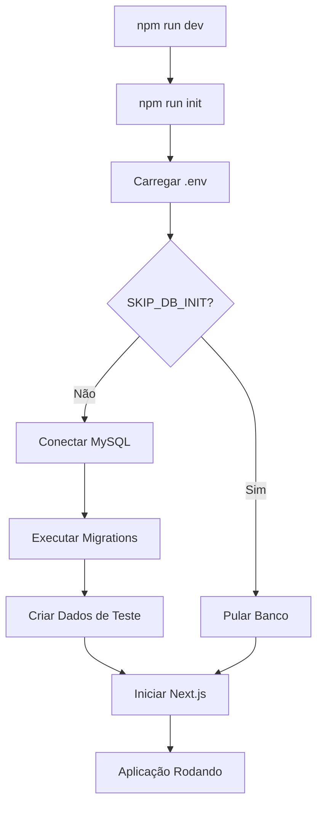

# 🚀 AutoBet App - Sistema de Inicialização

## 📋 Resumo das Configurações

O projeto agora possui um sistema completo de inicialização que:

1. **Carrega variáveis de ambiente** usando `dotenv`
2. **Inicializa o banco de dados** automaticamente
3. **Executa migrations** se necessário
4. **Cria dados de teste** automaticamente
5. **Funciona com ou sem banco de dados** (modo mock)

## 🔧 Arquivos Criados/Modificados

### ✅ Novos Arquivos:
- `.env` - Configurações de ambiente
- `.env.example` - Template de configurações
- `scripts/app-init.ts` - Script de inicialização global
- `ormconfig.ts` - Configuração do TypeORM

### ✅ Arquivos Atualizados:
- `package.json` - Scripts de inicialização
- `src/database/data-source.ts` - Configuração melhorada do banco
- `scripts/init-db.ts` - Script de inicialização do banco
- `scripts/setup-db.ts` - Script de setup do banco

## 🚀 Como Usar

### 1. **Executar em Desenvolvimento (com inicialização automática)**
```bash
npm run dev
```
Este comando agora executa automaticamente:
- `npm run init` (inicializa banco e dados)
- `next dev --turbopack` (inicia o servidor)

### 2. **Executar apenas a inicialização**
```bash
npm run init
```

### 3. **Pular inicialização do banco (usar apenas dados mock)**
```bash
SKIP_DB_INIT=true npm run dev
```

### 4. **Inicializar banco de dados manualmente**
```bash
npm run init-db    # Inicializa e cria usuário de teste
npm run setup-db   # Executa migrations e cria usuário de teste
```

## 🔐 Configurações de Ambiente

### Variáveis Principais (.env):
```env
# Banco de Dados
DB_HOST=localhost
DB_PORT=3306
DB_USERNAME=root
DB_PASSWORD=
DB_NAME=autobet

# JWT
JWT_SECRET=your-super-secret-jwt-key-change-this-in-production

# Ambiente
NODE_ENV=development
```

### Variáveis de Controle:
- `SKIP_DB_INIT=true` - Pula inicialização do banco
- `FORCE_DB_INIT=true` - Força reinicialização completa

## 📊 Fluxo de Inicialização



## 🎯 Credenciais de Teste

Quando o banco é inicializado, um usuário de teste é criado automaticamente:
- **Email:** `teste@teste.com`
- **Senha:** `123456`

## 🔄 Scripts Disponíveis

| Script | Descrição |
|--------|-----------|
| `npm run dev` | Desenvolvimento com inicialização |
| `npm run build` | Build com inicialização |
| `npm run start` | Produção com inicialização |
| `npm run init` | Apenas inicialização |
| `npm run init-db` | Inicializar banco + usuário teste |
| `npm run setup-db` | Migrations + usuário teste |

## 🛠️ Troubleshooting

### Erro de Conexão MySQL:
```bash
# 1. Instalar MySQL
sudo apt install mysql-server  # Ubuntu/Debian
brew install mysql             # macOS

# 2. Iniciar MySQL
sudo systemctl start mysql     # Ubuntu/Debian
brew services start mysql     # macOS

# 3. Criar banco de dados
mysql -u root -p
CREATE DATABASE autobet CHARACTER SET utf8mb4 COLLATE utf8mb4_unicode_ci;

# 4. Executar inicialização
npm run init
```

### Usar sem MySQL (dados mock):
```bash
SKIP_DB_INIT=true npm run dev
```

## 📁 Estrutura de Scripts

```
scripts/
├── app-init.ts      # Inicialização global (novo)
├── init-db.ts       # Inicialização do banco
└── setup-db.ts      # Setup com migrations
```

## ✨ Benefícios

1. **Inicialização Automática** - Tudo é configurado automaticamente
2. **Flexibilidade** - Funciona com ou sem banco de dados
3. **Desenvolvimento Rápido** - Dados de teste criados automaticamente
4. **Configuração Simples** - Apenas um arquivo .env
5. **Logs Informativos** - Feedback claro do que está acontecendo

---

**🎉 Agora você pode executar `npm run dev` e tudo será inicializado automaticamente!**
