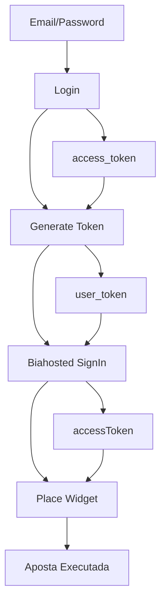

# 🎯 AutoBet Platform - Sistema de Automação de Apostas Esportivas

## 📋 Visão Geral

Sistema completo de automação de apostas esportivas que gerencia múltiplas contas em diferentes plataformas de apostas, com autenticação em cascata e cache inteligente de tokens.

## 🏗️ Arquitetura Recomendada

### **Next.js Full-Stack (Recomendado)**
- **Frontend**: Next.js 14+ com App Router
- **Backend**: API Routes do Next.js
- **Database**: MySQL com TypeORM
- **Cache**: Redis para tokens e sessões
- **Deploy**: Vercel (frontend) + Railway/Render (backend)

### **Alternativa: Arquitetura Separada**
- **Frontend**: Next.js standalone
- **Backend**: Node.js + Express/Fastify
- **Database**: MySQL com TypeORM
- **Cache**: Redis
- **Deploy**: Separado (mais complexo)

## 🔄 Fluxo de Autenticação em Cascata



### **4 Etapas do Processo:**

1. **Login** (`/api/auth/login`)
   - Input: `email`, `password`
   - Output: `access_token` (TTL: 172800s ≈ 48h)

2. **Generate Token** (`/api/generate-token`)
   - Input: `access_token` + `user_token` anterior
   - Output: `user_token` novo (TTL: 1h)

3. **Biahosted SignIn** (`/api/WidgetAuth/SignIn`)
   - Input: `user_token`
   - Output: `accessToken` (TTL: 1h)

4. **Place Widget** (`/api/widget/placeWidget`)
   - Input: `accessToken` + dados da aposta
   - Output: Resultado da aposta

## 🗄️ Estrutura do Banco de Dados

### **Tabela: accounts**
```sql
CREATE TABLE accounts (
  id VARCHAR(36) PRIMARY KEY,
  platform VARCHAR(50) NOT NULL, -- 'lotogreen', 'mcgames', 'estrelabet', etc.
  email VARCHAR(255) NOT NULL,
  password VARCHAR(255) NOT NULL, -- encrypted
  user_id VARCHAR(100),
  is_active BOOLEAN DEFAULT true,
  created_at TIMESTAMP DEFAULT CURRENT_TIMESTAMP,
  updated_at TIMESTAMP DEFAULT CURRENT_TIMESTAMP ON UPDATE CURRENT_TIMESTAMP,
  
  UNIQUE KEY unique_platform_email (platform, email)
);
```

### **Tabela: betting_strategies**
```sql
CREATE TABLE betting_strategies (
  id VARCHAR(36) PRIMARY KEY,
  name VARCHAR(255) NOT NULL,
  description TEXT,
  config JSON, -- configurações específicas da estratégia
  is_active BOOLEAN DEFAULT true,
  created_at TIMESTAMP DEFAULT CURRENT_TIMESTAMP
);
```

### **Tabela: betting_rules**
```sql
CREATE TABLE betting_rules (
  id VARCHAR(36) PRIMARY KEY,
  strategy_id VARCHAR(36),
  account_id VARCHAR(36),
  rule_config JSON, -- regras específicas
  is_active BOOLEAN DEFAULT true,
  created_at TIMESTAMP DEFAULT CURRENT_TIMESTAMP,
  
  FOREIGN KEY (strategy_id) REFERENCES betting_strategies(id),
  FOREIGN KEY (account_id) REFERENCES accounts(id)
);
```

### **Tabela: betting_history**
```sql
CREATE TABLE betting_history (
  id VARCHAR(36) PRIMARY KEY,
  account_id VARCHAR(36),
  strategy_id VARCHAR(36),
  bet_data JSON, -- dados completos da aposta
  result JSON, -- resultado da aposta
  status ENUM('pending', 'won', 'lost', 'cancelled'),
  amount DECIMAL(10,2),
  profit DECIMAL(10,2),
  created_at TIMESTAMP DEFAULT CURRENT_TIMESTAMP,
  
  FOREIGN KEY (account_id) REFERENCES accounts(id),
  FOREIGN KEY (strategy_id) REFERENCES betting_strategies(id)
);
```

## 🔧 Estrutura do Projeto Next.js

```
autobet-platform/
├── src/
│   ├── app/                    # App Router (Next.js 14+)
│   │   ├── (auth)/            # Grupo de rotas de autenticação
│   │   │   ├── login/
│   │   │   └── register/
│   │   ├── dashboard/         # Dashboard principal
│   │   ├── accounts/          # Gerenciamento de contas
│   │   ├── strategies/        # Estratégias de apostas
│   │   ├── history/          # Histórico de apostas
│   │   └── api/              # API Routes
│   │       ├── auth/
│   │       ├── accounts/
│   │       ├── betting/
│   │       └── platforms/
│   ├── components/           # Componentes reutilizáveis
│   │   ├── ui/              # Componentes base (shadcn/ui)
│   │   ├── forms/           # Formulários
│   │   └── charts/          # Gráficos e visualizações
│   ├── lib/                 # Utilitários e configurações
│   │   ├── db.ts           # Configuração do banco
│   │   ├── redis.ts        # Configuração do Redis
│   │   ├── auth.ts         # Configuração de autenticação
│   │   └── platforms/      # Integrações com plataformas
│   ├── types/              # Definições TypeScript
│   └── hooks/              # Custom hooks
├── prisma/                 # Schema do Prisma (se usar)
├── public/               # Arquivos estáticos
├── docs/                 # Documentação
└── tests/               # Testes
```

## 🔑 Sistema de Cache Redis

### **Estrutura de Chaves:**

```redis
# Tokens de autenticação por conta
auth:access_token:{account_id}     # TTL: 48h
auth:user_token:{account_id}       # TTL: 1h  
auth:platform_token:{account_id}  # TTL: 1h

# Cache de dados da conta
account:balance:{account_id}       # TTL: 5min
account:profile:{account_id}        # TTL: 30min

# Cache de mercados/odds
markets:live:{platform}            # TTL: 30s
markets:upcoming:{platform}        # TTL: 5min

# Sessões de usuário
session:{user_id}                  # TTL: 24h
```

### **Implementação Redis:**

```typescript
// lib/redis.ts
import Redis from 'ioredis';

const redis = new Redis({
  host: process.env.REDIS_HOST,
  port: parseInt(process.env.REDIS_PORT || '6379'),
  password: process.env.REDIS_PASSWORD,
});

export class TokenManager {
  static async setAccessToken(accountId: string, token: string, ttl: number = 172800) {
    await redis.setex(`auth:access_token:${accountId}`, ttl, token);
  }

  static async getAccessToken(accountId: string): Promise<string | null> {
    return await redis.get(`auth:access_token:${accountId}`);
  }

  static async isTokenValid(accountId: string): Promise<boolean> {
    const token = await redis.get(`auth:access_token:${accountId}`);
    return token !== null;
  }

  static async refreshTokens(accountId: string) {
    // Implementar lógica de refresh em cascata
    // 1. Verificar access_token
    // 2. Se inválido, fazer login
    // 3. Gerar user_token
    // 4. Gerar platform_token
  }
}
```

## 🎮 Integração com Plataformas

### **Estrutura Modular:**

```typescript
// lib/platforms/base.ts
export abstract class BasePlatform {
  abstract login(credentials: LoginCredentials): Promise<AccessToken>;
  abstract generateToken(accessToken: string, userToken: string): Promise<UserToken>;
  abstract signIn(userToken: string): Promise<PlatformToken>;
  abstract placeBet(token: string, betData: BetData): Promise<BetResult>;
}

// lib/platforms/lotogreen.ts
export class LotogreenPlatform extends BasePlatform {
  private baseUrl = 'https://lotogreen.bet.br';
  
  async login(credentials: LoginCredentials): Promise<AccessToken> {
    // Implementação específica do Lotogreen
  }
  
  // ... outros métodos
}

// lib/platforms/mcgames.ts
export class McgamesPlatform extends BasePlatform {
  private baseUrl = 'https://mcgames.bet.br';
  
  // Mesma estrutura, URLs diferentes
}
```

### **Factory Pattern:**

```typescript
// lib/platforms/factory.ts
export class PlatformFactory {
  static create(platformName: string): BasePlatform {
    switch (platformName) {
      case 'lotogreen':
        return new LotogreenPlatform();
      case 'mcgames':
        return new McgamesPlatform();
      case 'estrelabet':
        return new EstrelabetPlatform();
      default:
        throw new Error(`Platform ${platformName} not supported`);
    }
  }
}
```

## 🔄 Sistema de Estratégias

### **Estratégias Configuráveis:**

```typescript
// types/strategy.ts
export interface BettingStrategy {
  id: string;
  name: string;
  type: 'martingale' | 'fibonacci' | 'fixed' | 'percentage';
  config: {
    baseAmount: number;
    maxAmount: number;
    maxLosses: number;
    conditions: BettingCondition[];
  };
}

export interface BettingCondition {
  field: 'odds' | 'sport' | 'league' | 'team';
  operator: '>' | '<' | '=' | 'contains';
  value: any;
}
```

### **Motor de Estratégias:**

```typescript
// lib/strategies/engine.ts
export class StrategyEngine {
  async executeStrategy(strategy: BettingStrategy, account: Account) {
    // 1. Buscar oportunidades
    // 2. Aplicar condições
    // 3. Calcular valor da aposta
    // 4. Executar aposta
    // 5. Registrar resultado
  }
}
```

## 📊 Dashboard e Monitoramento

### **Métricas Principais:**
- Saldo por conta
- Apostas por dia/semana/mês
- Taxa de acerto
- Lucro/Prejuízo
- Status dos tokens
- Logs de erro

### **Componentes Dashboard:**
```typescript
// components/dashboard/AccountStatus.tsx
export function AccountStatus({ accounts }: { accounts: Account[] }) {
  return (
    <div className="grid grid-cols-1 md:grid-cols-3 gap-4">
      {accounts.map(account => (
        <Card key={account.id}>
          <CardHeader>
            <CardTitle>{account.platform}</CardTitle>
            <CardDescription>{account.email}</CardDescription>
          </CardHeader>
          <CardContent>
            <div className="flex items-center justify-between">
              <span>Saldo:</span>
              <span className="font-bold">R$ {account.balance}</span>
            </div>
            <TokenStatus accountId={account.id} />
          </CardContent>
        </Card>
      ))}
    </div>
  );
}
```

## 🔐 Autenticação e Segurança

### **Sistema de Login:**
```typescript
// app/api/auth/login/route.ts
export async function POST(request: Request) {
  const { email, password } = await request.json();
  
  // 1. Validar credenciais
  // 2. Gerar JWT
  // 3. Criar sessão no Redis
  // 4. Retornar token
}
```

### **Middleware de Autenticação:**
```typescript
// middleware.ts
export function middleware(request: NextRequest) {
  const token = request.cookies.get('auth-token');
  
  if (!token && request.nextUrl.pathname.startsWith('/dashboard')) {
    return NextResponse.redirect(new URL('/login', request.url));
  }
}
```

## 🚀 Deploy e Infraestrutura

### **Ambientes:**
- **Development**: Local com Docker Compose
- **Staging**: Vercel Preview + Railway
- **Production**: Vercel + Railway + Redis Cloud

### **Docker Compose (Desenvolvimento):**
```yaml
version: '3.8'
services:
  app:
    build: .
    ports:
      - "3000:3000"
    environment:
      - DATABASE_URL=mysql://root:password@db:3306/autobet
      - REDIS_URL=redis://redis:6379
    depends_on:
      - db
      - redis

  db:
    image: mysql:8.0
    environment:
      - MYSQL_ROOT_PASSWORD=password
      - MYSQL_DATABASE=autobet
    volumes:
      - mysql_data:/var/lib/mysql

  redis:
    image: redis:7-alpine
    ports:
      - "6379:6379"
```

## 📈 Roadmap de Funcionalidades

### **Fase 1 - MVP (4 semanas):**
- ✅ Sistema de autenticação em cascata
- ✅ Gerenciamento de contas
- ✅ Dashboard básico
- ✅ Apostas manuais
- ✅ Cache Redis

### **Fase 2 - Automação (4 semanas):**
- 🤖 Estratégias básicas (Martingale, Fibonacci)
- 📊 Análise de performance
- 🔔 Notificações (Telegram, Email)
- 📱 App mobile (React Native)

### **Fase 3 - Avançado (8 semanas):**
- 🧠 IA para análise de odds
- 📈 Integração com APIs de estatísticas
- 🔄 Apostas automáticas baseadas em eventos
- 🌐 Suporte a mais plataformas

### **Fase 4 - Escala (Ongoing):**
- ☁️ Deploy em múltiplas regiões
- 📊 Analytics avançados
- 🔒 Auditoria e compliance
- 🤝 API pública para terceiros

## 🛠️ Tecnologias Recomendadas

### **Core:**
- **Next.js 14+** (App Router)
- **TypeScript** (tipagem forte)
- **Tailwind CSS** (styling)
- **shadcn/ui** (componentes)

### **Backend:**
- **TypeORM** (ORM)
- **MySQL** (banco principal)
- **Redis** (cache)
- **Prisma** (alternativa ao TypeORM)

### **Deploy:**
- **Vercel** (frontend)
- **Railway/Render** (backend)
- **Redis Cloud** (cache)
- **PlanetScale** (banco)

### **Monitoramento:**
- **Sentry** (erros)
- **Vercel Analytics** (performance)
- **Uptime Robot** (disponibilidade)

## 💡 Próximos Passos

1. **Configurar ambiente de desenvolvimento**
2. **Implementar sistema de autenticação**
3. **Criar estrutura do banco de dados**
4. **Desenvolver integração com primeira plataforma**
5. **Implementar dashboard básico**
6. **Adicionar sistema de cache Redis**
7. **Testes e deploy**

---

**🎯 Objetivo:** Criar a plataforma mais robusta e escalável para automação de apostas esportivas, com foco em segurança, performance e facilidade de uso.
